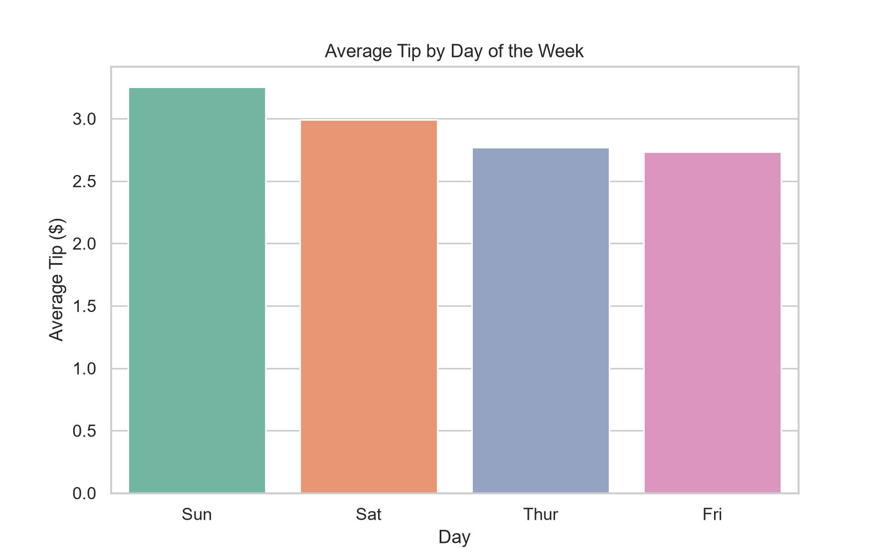
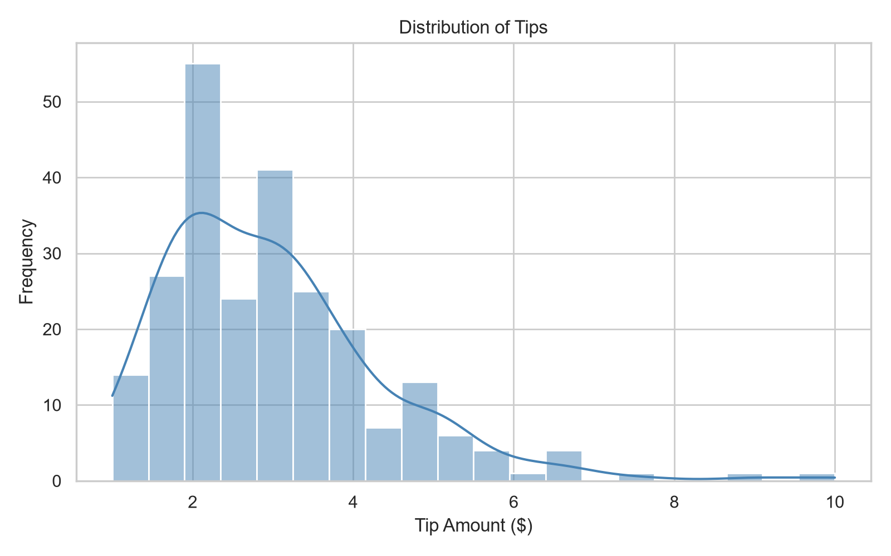
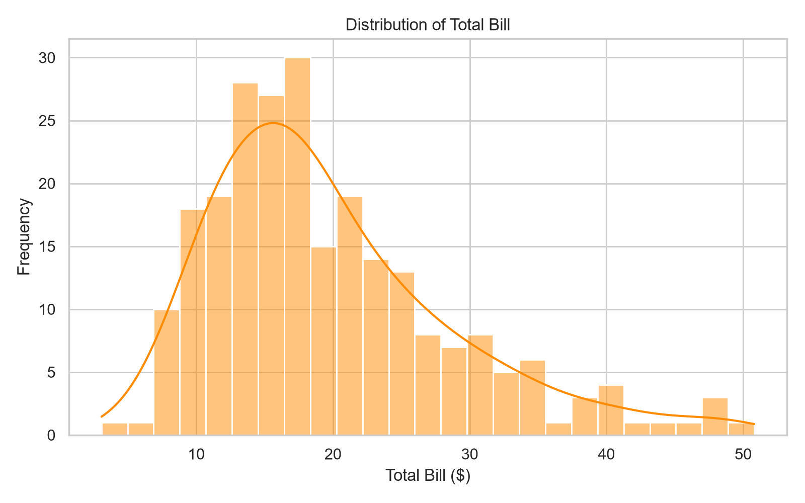
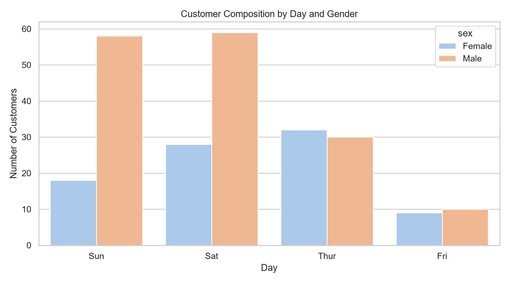
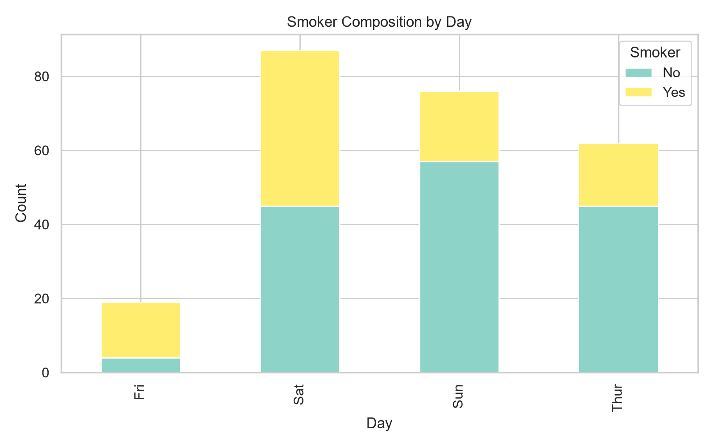
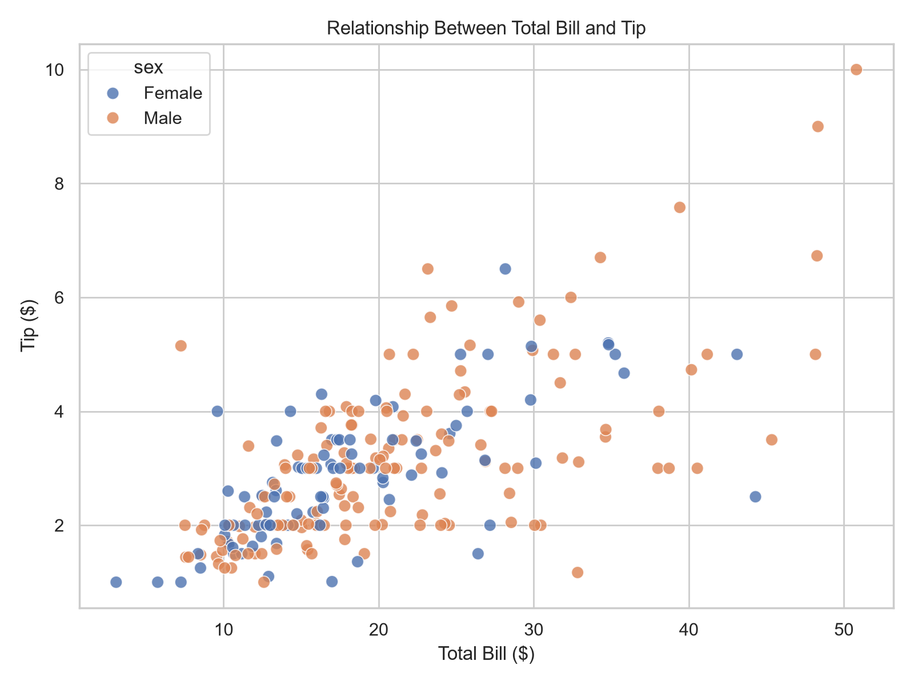
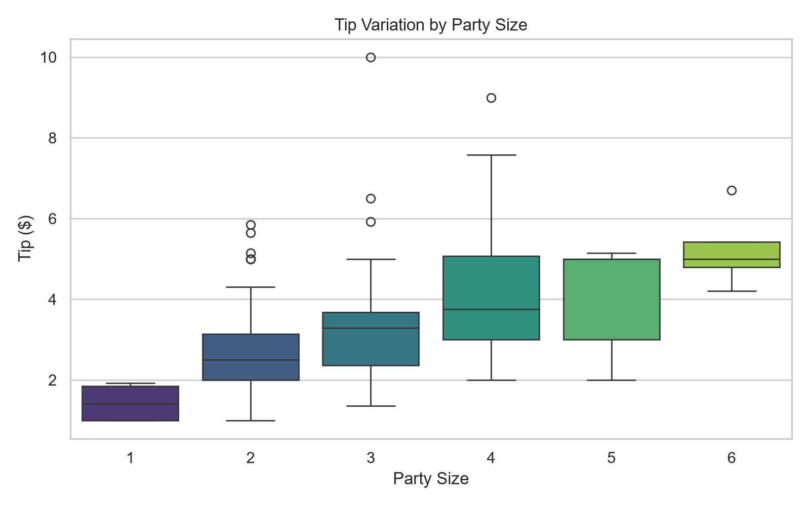

# Data Analytics Report

## 1. Overview

This report analyzes the restaurant tips dataset to understand customer behavior, spending patterns, and the relationship between bill size and tip amount. The dataset includes 244 records and covers variables such as total bill, tip, customer gender, smoking status, day of the week, meal time, and party size.

Key findings:

- Average total bill: $19.79
- Average tip: $3.00
- Average party size: 2.57 guests
- The strongest relationship in the dataset is between total bill and tip, which suggests that larger bills generally lead to larger tips.
- Weekend dining, especially Saturday and Sunday, is associated with the highest sales volume and tip activity.

---

## 2. Comparison Analysis

### 2.1 Average Tip by Day of the Week

This comparison highlights how tipping patterns vary across the week. The strongest average tip is observed on Saturday, followed by Sunday. This suggests that restaurants may experience higher tip values during weekend dining.

### Interpretation

- Saturday has the highest average tip, indicating a strong weekend tipping pattern.
- Sunday also shows elevated tipping compared with weekdays.
- Thursday and Friday remain comparatively lower, showing more moderate tipping behavior.

This comparison helps to identify the best-performing days for customer spend and service-related upsell opportunities.

---

## 3. Distribution Analysis

### 3.1 Distribution of Tips

The tip distribution shows a right-skewed pattern, with most tips clustered at lower values and a smaller number of higher tip amounts. This is common in service-based data, where many transactions produce moderate tips while a few larger tips create a longer upper tail.

### 3.2 Distribution of Total Bill

The total bill distribution also shows a wide spread, indicating variability in customer spending. Most bills fall within a moderate range, while some transactions are considerably higher, suggesting larger groups or more expensive orders.

### Interpretation

- Tips are concentrated around lower-to-moderate values, with visible variability.
- Total bills vary significantly across transactions, reflecting different dining occasions and group sizes.
- Both distributions suggest that the dataset contains a broad mix of customer spending behaviors rather than a narrow, uniform pattern.

---

## 4. Composition Analysis

### 4.1 Customer Composition by Day and Gender

This chart shows how many customers visited across different days and how that demand is spread between male and female diners. It helps identify both the busiest days and the composition of the customer base.

### 4.2 Smoker Composition by Day

This composition view compares the number of smokers and non-smokers across days. It helps understand whether smoking status is associated with certain dining periods or customer segments.

### Interpretation

- Saturday and Sunday account for the largest number of customer visits.
- Male customers represent the majority of observations in the dataset.
- Non-smokers outnumber smokers in the data, though smoking behavior remains a meaningful segment.
- Weekend dining appears to be the most active period in the restaurant, which may influence staffing, menu promotions, and service planning.

---

## 5. Relationship Analysis

### 5.1 Relationship Between Total Bill and Tip

This scatter plot shows the relationship between total bill and tip amount. The upward trend indicates that higher bills are usually associated with higher tips, showing a clear positive relationship.

### 5.2 Tip Variation by Party Size

This box plot shows how tip amounts change based on party size. Larger groups are likely to produce higher total bills, but the distribution also suggests that tip behavior may vary depending on group composition.

### Interpretation

- There is a strong positive relationship between total bill and tip.
- As party size increases, tipping patterns become more variable, but larger groups often contribute more to bill totals.
- This relationship is important for revenue forecasting, customer service quality monitoring, and restaurant sales planning.

---

## 6. Key Business Insights

1. Weekend dining generates the highest sales and strongest tip values.
2. Total bill is the strongest driver of tipping behavior in the dataset.
3. The customer base is dominated by male diners, with a substantial share of non-smoker customers.
4. The restaurant experiences a wide range of spending levels, suggesting diverse customer occasions and group sizes.
5. Across the week, the data suggests a pattern of stronger service activity and greater customer spend during weekends.

---

## 7. Conclusion

The dataset reveals meaningful patterns in restaurant spending, customer composition, and service behavior. The strongest signals are related to weekend activity, higher total bills leading to higher tips, and the overall distribution of spending across different customer segments. These findings provide useful insight for restaurant operations, forecasting, and customer experience management.

This report is designed to be exported to PDF in a clean, presentation-ready format.
